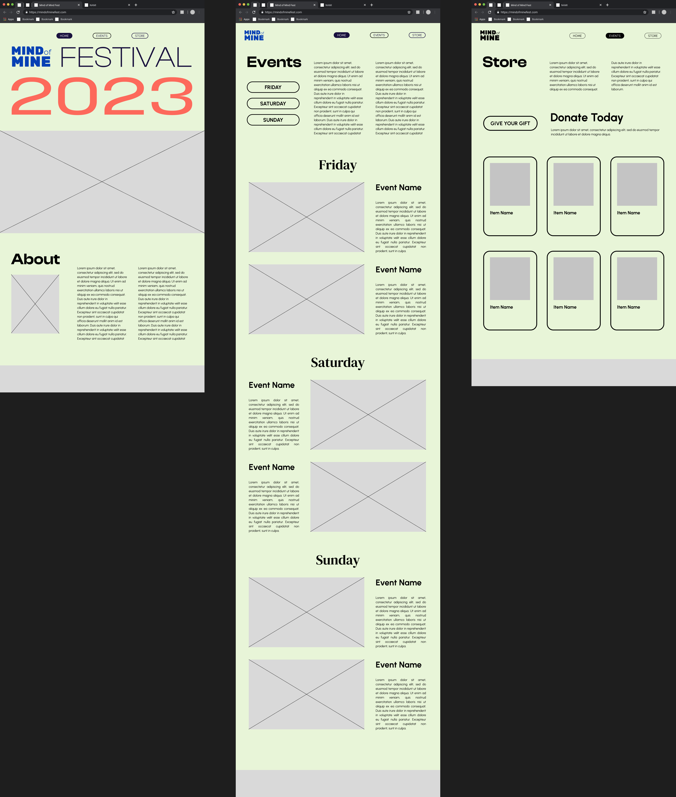

# MIND of MINE 2023: A Social Justice Festival
November 15, 2023

by Zanett Velazquez

Hosted currently at https://zvelazquez.github.io/festival-website/

***
# Project Overview
Mental Health is an issue that impacts 1 in 5 people in the United States. I myself am one of those individuals. 

Since high school, I have struggled with anxiety and depression, and my observations from my own life and the lives of others around me have opened my eyes to the disparities surrounding this issue. Minority groups and people of color tend to have less access to mental health resources and support services, leading to the silent suffering of many within these communities. Additionally, stigma around the issue of mental health is especially prevalent within these communities as well, making it difficult for many to get the help and support that they need, or being unaware of the resources and services available to them.

When approaching this project, I wanted to make sure that I told the right story. I wanted this project to be inclusive, and give a voice to those who often go unheard or ignored. My purpose when approaching this project was to shed light on this issue from a variety of different perspectives, and to respectfully consider the unique experiences of different individuals when it comes to this issue.  

This website was created as an accompanying complimentary feature to an imaginary social justice festival helping to raise awareness around the issue of mental illness. The festival was concieved as an ideal and accessible approach to help people with mental illness and their families to access resources and learn about ways that they can help combat the stigma.

Hosted over the course of 3 days, this festival website aids in providing informational details surrounding the event, from background and "about" information for partnering organizations (such as NAMI, the National Allicance on Mental Illness), event schedules and activity information, and a store where users can purchase commemorative goods from the festival (along with the option to donate to the cause). 

I developed the branding and visual idenity of the festival by gathering inspiration and creating moodboards during brainstorming phases, and then moving to font and typeface selection before finally selecting a color palette. I additionally created original assets used throughout the website and festival material branding.

***
# Technical Overview
For this project, I worked primarily in Figma and Visual Studio Code to ideate and create my festival website. 

## Figma Wireframes

https://www.figma.com/file/rTbr2Yj4xT0tzpzDjOFNxj/Untitled?type=design&node-id=0%3A1&mode=design&t=Kqh6bQuODbjm2mDL-1 

## Code & Development
This website was created using HTML and CSS coding in the application Visual Studio Code.

The repository for this site is currently being hosted on GitHub. 

## Fonts & Typefaces
For my website, I incorporated the use of 3 fonts:
* Clash Display: This font is used in the website primarily for large headers and page titles  
    * This is a free font designed by the Indian Type Foundry, available on Fontshare.com under an ITF Free Font License. (https://www.fontshare.com/fonts/clash-display)

* DM Serif Text: This font is used in the website as a section title, mostly on the events page to seperate the different sections for the different dates
    * This is a free font available from Google Fonts. (https://fonts.google.com/specimen/DM+Serif+Text)

* Urbanist: This font is used the most throughout the website design. Used mostly for large bodies and blocks of informational text and descriptions, with some instances of the font being used for buttons (displayed in all capitals in these instances)
    * This is a free font available from Google Fonts. (https://fonts.google.com/specimen/Urbanist?query=urbanist)

## Acknowledgments
Acknowledgements will go here.

***

**README still in progress. Will be updated as project progresses toward completion. 